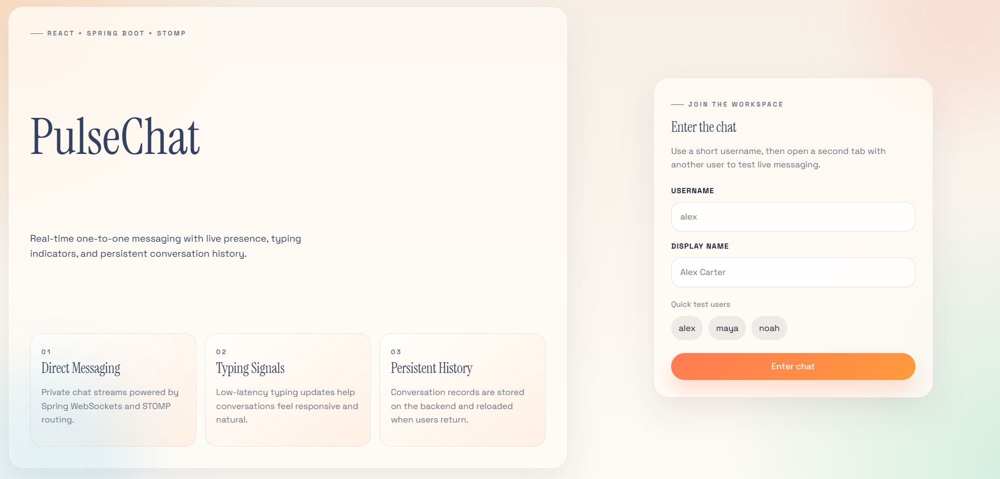

Backend terminal:
cd "C:\Users\N.vignesh reddy\OneDrive\Documents\New project\real-time-chat-app\backend"
.\gradlew.bat bootRun

Frontend terminal:
cd "C:\Users\N.vignesh reddy\OneDrive\Documents\New project\real-time-chat-app\frontend"
npm install
npm run dev
After that:

Open http://localhost:5173
Enter a username like alex
Open the same URL in another tab/browser
Login with another username like maya
Start chatting

